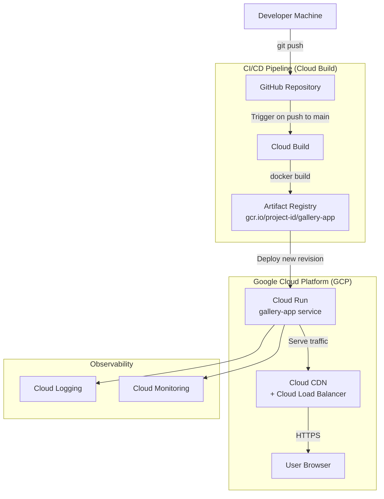

# System Architecture — Photo Gallery SPA

**Author:** Nuttapat Pothavichai  
**Position:** Full-Stack Developer  
**Stack:** Next.js · TypeScript · Google Cloud Platform

---

## 1. Application Overview

A **Single-Page Application (SPA)** that serves a Masonry-style photo gallery with:
- **Infinite Scroll** via the `Intersection Observer` API — loads 12 images per page
- **Client-side Tag Filtering** — URL-driven state, zero page reload
- **URL Synchronization** — Filters are synced with query parameters (`?tag=...`) for shareability
- **Skeleton Loaders** — Premium loading experience for better perceived performance
- **Server-side API** (Next.js Route Handlers) for data pagination & filtering

---

## 2. High-Level Architecture (Production)

```
                        ┌─────────────────────────────────┐
                        │         Google Cloud Platform    │
                        │                                  │
  User Browser  ───────▶│  Cloud CDN  ──▶  Cloud Run      │
  (HTTPS)               │                 (Next.js App)   │
                        │                      │           │
                        │               Artifact Registry  │
                        │               (Docker Images)    │
                        │                      ▲           │
                        │               Cloud Build        │
                        │               (CI/CD Pipeline)   │
                        └─────────────────────────────────┘
                                      ▲
                               GitHub / GitLab
                               (Source Code)
```

---

## 3. Production Architecture Diagram



---

## 4. Component Breakdown

### 4.1 Frontend — Next.js (App Router)

| Component | Description |
|---|---|
| `app/page.tsx` | Home page entry point |
| `app/layout.tsx` | Root HTML layout, font loading (Inter) |
| `app/globals.css` | Design system — Masonry grid, tokens, animations |
| `components/Gallery.tsx` | Infinite scroll logic via `IntersectionObserver` |
| `components/ImageCard.tsx` | Displays one image with clickable hashtags |

### 4.2 Backend — Next.js API Routes (BFF Pattern)

| Endpoint | Method | Description |
|---|---|---|
| `/api/images` | `GET` | Returns paginated images. Accepts `page`, `limit`, `tag` query params |

### 4.3 Data Layer (Mock — Production-ready interface)

| File | Description |
|---|---|
| `lib/mock-data.ts` | In-memory image store with 100 items. Generates random dimensions (400–800 × 500–1000) and random tags from a 15-word vocabulary. Can be replaced with a real DB driver (e.g., PostgreSQL via Prisma) with no interface change. |

---

## 5. Production Server Specifications

### Cloud Run (Application Server)

| Parameter | Value |
|---|---|
| **Service** | Google Cloud Run (Fully managed) |
| **Container** | Docker — `node:20-alpine` base image |
| **CPU** | 1 vCPU (auto-scale up to 4) |
| **Memory** | 512 MB |
| **Concurrency** | 80 requests / instance |
| **Min Instances** | 1 (to avoid cold start) |
| **Max Instances** | 10 |
| **Region** | `asia-southeast1` (Singapore) — low latency for Thailand |

### Networking & CDN

| Component | Technology |
|---|---|
| **DNS** | Cloud DNS |
| **Load Balancer** | Cloud Load Balancing (Global HTTPS LB) |
| **CDN** | Cloud CDN — caches static assets (JS, CSS, images) |
| **SSL** | Google-managed SSL certificate (auto-renew) |

### OS & Runtime

| Layer | Technology |
|---|---|
| **OS** | Container OS (managed by Cloud Run — Debian-based) |
| **Runtime** | Node.js 20 LTS |
| **Framework** | Next.js 15 (App Router) |

---

## 6. CI/CD Pipeline

```
┌──────────┐    push     ┌─────────────────────────────────────────────┐
│ Developer │───────────▶│              Cloud Build Trigger             │
└──────────┘             │                                             │
                         │  Step 1: npm ci                             │
                         │  Step 2: npm run lint                       │
                         │  Step 3: npm run build (Next.js)            │
                         │  Step 4: docker build -t gcr.io/…/app .    │
                         │  Step 5: docker push gcr.io/…/app:$SHA     │
                         │  Step 6: gcloud run deploy gallery-app \    │
                         │          --image gcr.io/…/app:$SHA          │
                         └─────────────────────────────────────────────┘
```

**Branch Strategy:**
- `main` → Auto-deploy to **Production** (Cloud Run)
- `develop` → Auto-deploy to **Staging** (separate Cloud Run service)

---

## 7. Dockerfile

```dockerfile
# Stage 1: Build
FROM node:20-alpine AS builder
WORKDIR /app
COPY package*.json ./
RUN npm ci
COPY . .
RUN npm run build

# Stage 2: Production image
FROM node:20-alpine AS runner
WORKDIR /app
ENV NODE_ENV=production

COPY --from=builder /app/.next/standalone ./
COPY --from=builder /app/.next/static ./.next/static
COPY --from=builder /app/public ./public

EXPOSE 3000
CMD ["node", "server.js"]
```

---

## 8. Estimated Production Cost (GCP)

| Service | Estimated Monthly Cost |
|---|---|
| Cloud Run (1 min instance, low traffic) | ~$5–10 USD |
| Cloud CDN | ~$2–5 USD (first 10 GB free) |
| Artifact Registry | ~$1 USD |
| Cloud Build | Free tier (120 min/day) |
| **Total** | **~$8–16 USD/month** |

---

## 9. Scalability Path

```
Current (MVP)             →   Scale Up                →   Enterprise
─────────────────────────     ─────────────────────────   ─────────────────
Cloud Run (stateless)         Add Cloud SQL             Kubernetes (GKE)
In-memory mock data           (PostgreSQL)              Multi-region LB
Single region                 Redis for caching         Global CDN
                              Multi-AZ Cloud Run        Image CDN (Cloud Storage)
```

---

## 10. Local Development Setup

```bash
# 1. Clone the repository
git clone <repo-url>
cd single-page-app

# 2. Install dependencies
npm install

# 3. Start development server
npm run dev

# 4. Open in browser
open http://localhost:3000
```
